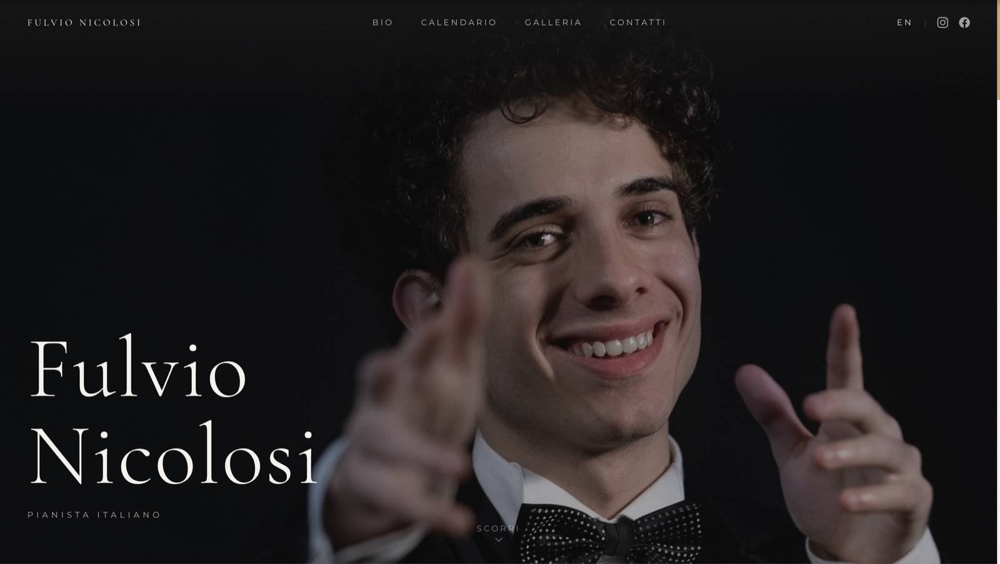
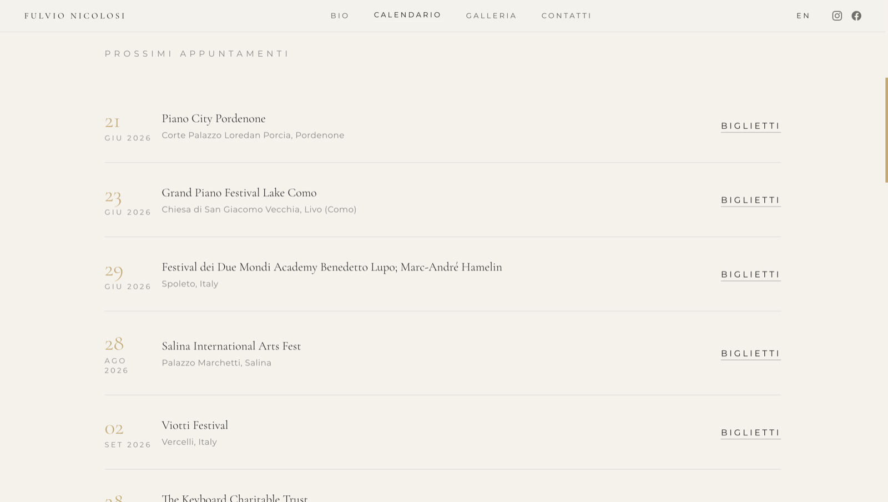
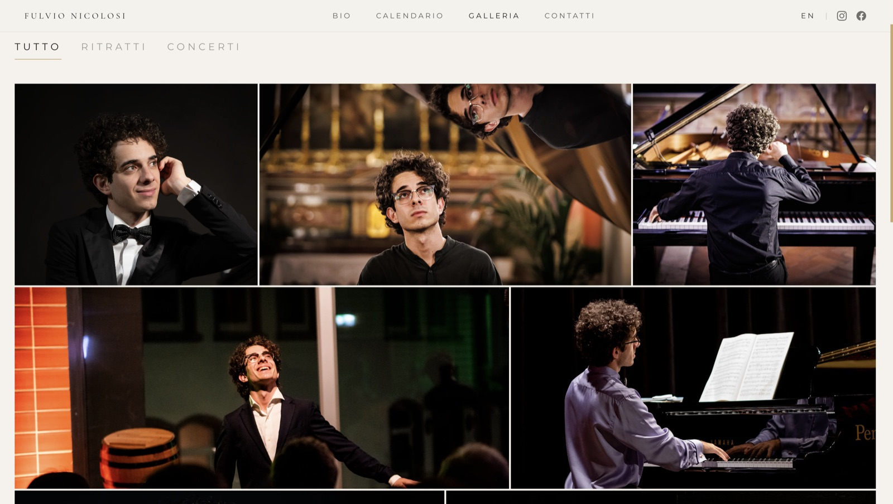

# Fulvio Nicolosi — Official Website

The official website of Italian concert pianist **Fulvio Nicolosi**: a bilingual static site with a live concert agenda managed through Notion.

**Live:** https://fulvionicolosi.com

## Preview

**Home**



**Live agenda — powered by Notion**



**Gallery**



## Features

- **Bilingual (IT/EN)** with an in-page language toggle; the choice is persisted in `localStorage`.
- **Live concert agenda** managed in **Notion** as a headless CMS — upcoming and past appointments update without touching the code.
- **Contact form** handled by Web3Forms (no backend to maintain).
- **Image gallery** with WebP delivery for display and full-resolution originals available for download; swipe navigation on mobile.
- **Responsive design**, animated mobile menu, hero imagery, video sections, rotating quotes, and scroll-reveal animations.
- **Press kit** — short and full biographies (IT/EN) as downloadable PDFs.

## Tech stack

| Area | Technology |
|------|------------|
| Markup & styling | HTML5, Tailwind CSS (CDN) |
| Interactions | Vanilla JavaScript (no framework) |
| Hosting | Cloudflare Pages |
| Content / CMS | Notion API |
| API proxy | Cloudflare Workers |
| Contact form | Web3Forms |

## Architecture

Concert data lives in a Notion database. The browser never talks to Notion directly: requests go through a small **Cloudflare Worker** that injects the Notion integration token server-side and returns JSON.

```
Browser ──fetch──▶ Cloudflare Worker ──Bearer token──▶ Notion API
   ▲                                                      │
   └──────────────────── concerts JSON ◀──────────────────┘
```

This keeps the secret token out of the client and out of the repository — only the public Worker URL is shipped to the browser.

## Project structure

```
.
├── index.html          # Home (hero, bio, latest concerts, video, contact)
├── bio.html            # Full biography
├── calendar.html       # Full agenda (upcoming + past)
├── gallery.html        # Photo gallery
├── worker.js           # Cloudflare Worker: Notion API proxy
├── favicon.svg
├── img/
│   ├── img-original/   # Full-resolution images (downloads)
│   └── img-web/        # Optimized WebP for display
└── press-kit/          # Biography PDFs (IT/EN)
```

## Local development

The site is fully static and loads Tailwind via CDN — no build step required.

```bash
# serve the folder with any static server, e.g.
npx serve .
# or simply open index.html in a browser
```

## Deployment

- **Site:** Cloudflare Pages connected to this repository (branch `main`, no build command, output directory `/`).
- **Worker:** deployed separately with a `NOTION_TOKEN` secret; the Notion database is shared with the integration.

## Credits

Design & development — **Marco Sapienza**.
