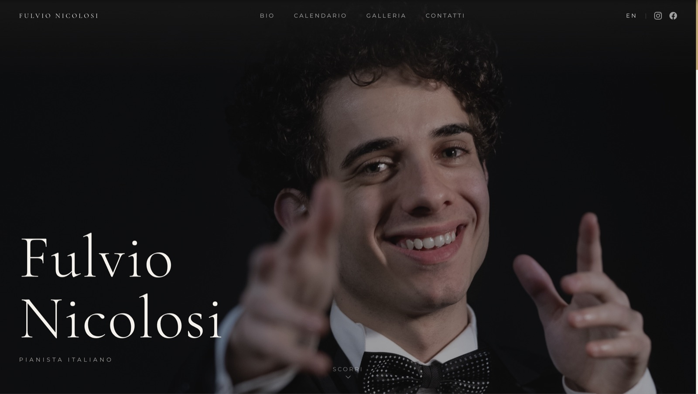
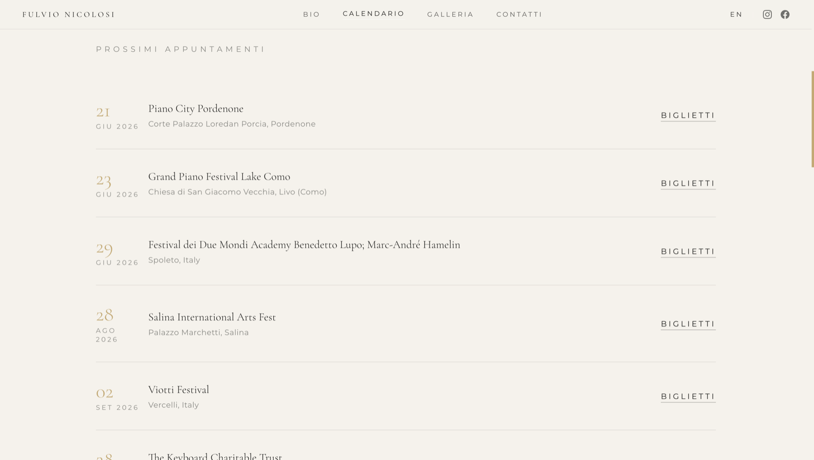
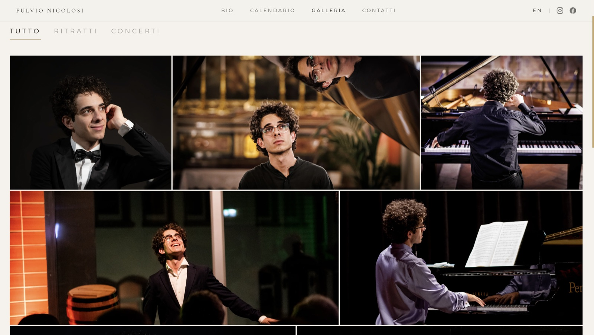

<h1 align="center">Fulvio Nicolosi — Official Website</h1>

<p align="center">
  
  
  
</p>
<p align="center">
  
  
  
  
</p>

<p align="center">The official website of Italian concert pianist <strong>Fulvio Nicolosi</strong> — a bilingual static site with a live concert agenda managed through Notion.</p>

<p align="center"><strong>Live:</strong> <a href="https://fulvionicolosi.com">fulvionicolosi.com</a></p>

## Preview

**Home**



**Live agenda — powered by Notion**



**Gallery**



## Features

- **Bilingual (IT/EN)** with an in-page language toggle; the choice is persisted in `localStorage`.
- **Live concert agenda** managed in **Notion** as a headless CMS — upcoming and past appointments update without touching the code.
- **Contact form** handled by Web3Forms (no backend to maintain).
- **Image gallery** with WebP delivery for display and full-resolution originals available for download; swipe navigation on mobile.
- **Responsive design**, animated mobile menu, hero imagery, video sections, rotating quotes, and scroll-reveal animations.
- **Press kit** — short and full biographies (IT/EN) as downloadable PDFs.
- **SEO** — per-page meta descriptions, canonical URLs, Open Graph and Twitter cards, `sitemap.xml`, `robots.txt`, and Person structured data (JSON-LD).

## Tech stack

| Area | Technology |
|------|------------|
| Markup & styling | HTML5, Tailwind CSS — v4 compiled on the home page, v3 via CDN on the other three |
| Interactions | Vanilla JavaScript (no framework) |
| Hosting | Cloudflare Pages |
| Content / CMS | Notion API |
| API proxy | Cloudflare Workers |
| Contact form | Web3Forms |

## Architecture

Concert data lives in a Notion database. The browser never talks to Notion directly: requests go through a small **Cloudflare Worker** that injects the Notion integration token server-side and returns JSON.

```
Browser ──fetch──▶ Cloudflare Worker ──Bearer token──▶ Notion API
   ▲                                                      │
   └──────────────────── concerts JSON ◀──────────────────┘
```

This keeps the secret token out of the client and out of the repository — only the public Worker URL is shipped to the browser.

## Project structure

```
.
├── index.html          # Home (hero, bio, latest concerts, video, contact)
├── bio.html            # Full biography
├── calendar.html       # Full agenda (upcoming + past)
├── gallery.html        # Photo gallery
├── worker.js           # Cloudflare Worker: Notion API proxy
├── favicon.svg
├── robots.txt
├── sitemap.xml
├── googleb773b7620e152a89.html   # Search Console ownership — do not remove
├── src/
│   ├── input.css       # Tailwind v4 source and theme (home page only)
│   └── output.css      # Compiled stylesheet loaded by index.html
├── img/
│   ├── img-original/   # Full-resolution images (downloads)
│   ├── img-web/        # Optimized WebP for display
│   └── og-image.jpg    # 1200×630 social sharing preview
└── press-kit/          # Biography PDFs (IT/EN)
```

## Local development

The site is static — no bundler, no framework. Serve the folder with any static
server, or simply open a page in the browser:

```bash
npx serve .
```

Styling is split, and this matters when editing classes:

- `bio.html`, `calendar.html`, `gallery.html` pull Tailwind from the CDN and
  configure the theme inline, so changes are live on reload — no build step.
- `index.html` loads the compiled `src/output.css` instead, so **any new class
  used there needs a rebuild**, otherwise it simply will not exist:

```bash
npm install          # once
npm run build:css    # regenerates src/output.css from src/input.css
```

Site-wide rules and theme tokens added to `src/input.css` therefore apply to the
home page only; the other three need the same change in their inline config.
Migrating them to the compiled stylesheet is open work.

## Deployment

- **Site:** Cloudflare Pages connected to this repository (branch `main`, no build command, output directory `/`).
- **Worker:** deployed separately with a `NOTION_TOKEN` secret; the Notion database is shared with the integration.

Cloudflare Pages serves `src/output.css` as committed, so remember to run
`npm run build:css` and commit the result before pushing changes to the home page.

The canonical host is `https://fulvionicolosi.com` (no `www`); `sitemap.xml` and
every `<link rel="canonical">` use the extensionless paths (`/bio`, `/calendar`,
`/gallery`) that Cloudflare actually serves — the `.html` forms answer with a 308.

## Credits

Design & development — **Marco Sapienza**.
